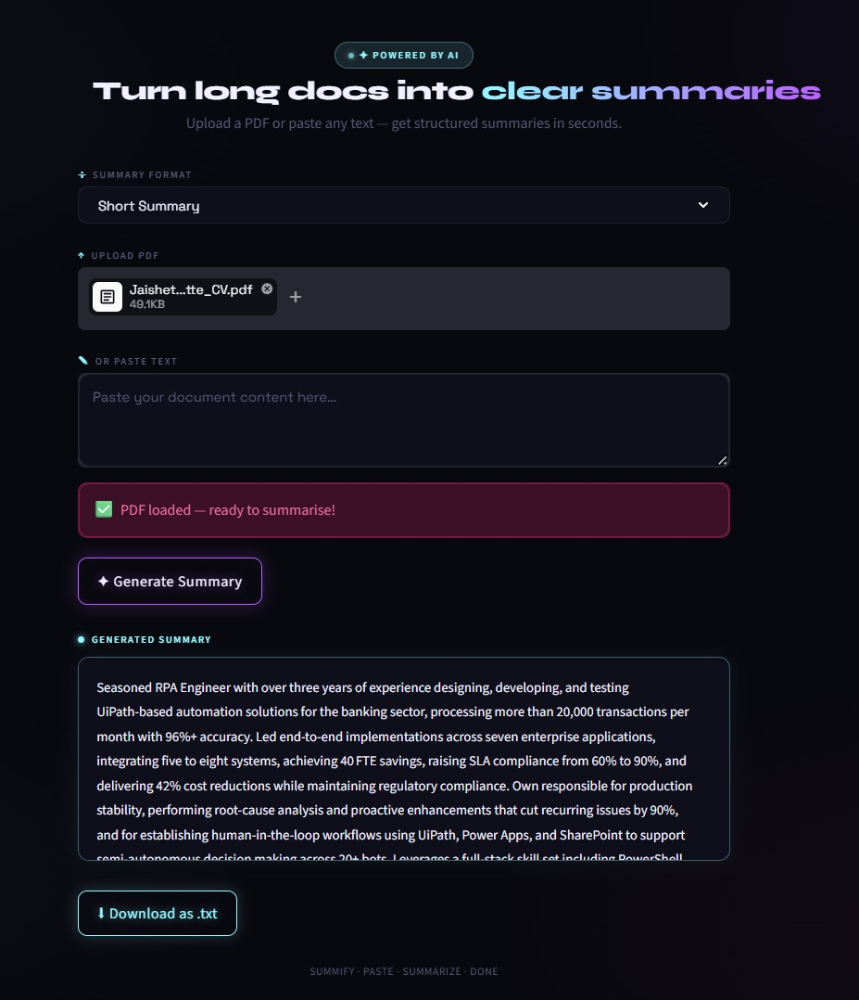

# AI Document Summarizer

An AI-powered PDF/document summarizer built using Python and Streamlit.

## Features
- Upload PDF documents/text
- Generate AI summaries
- Clean modern UI
- Different summary styles

## Tech Stack
- Python
- Streamlit
- OpenAI API

 

 [Click-here for **All 15 Projects Live Link**](https://aipowered-document-summarizer.streamlit.app/)
 
  

 **_Output Screenshot_** :  

 

 
